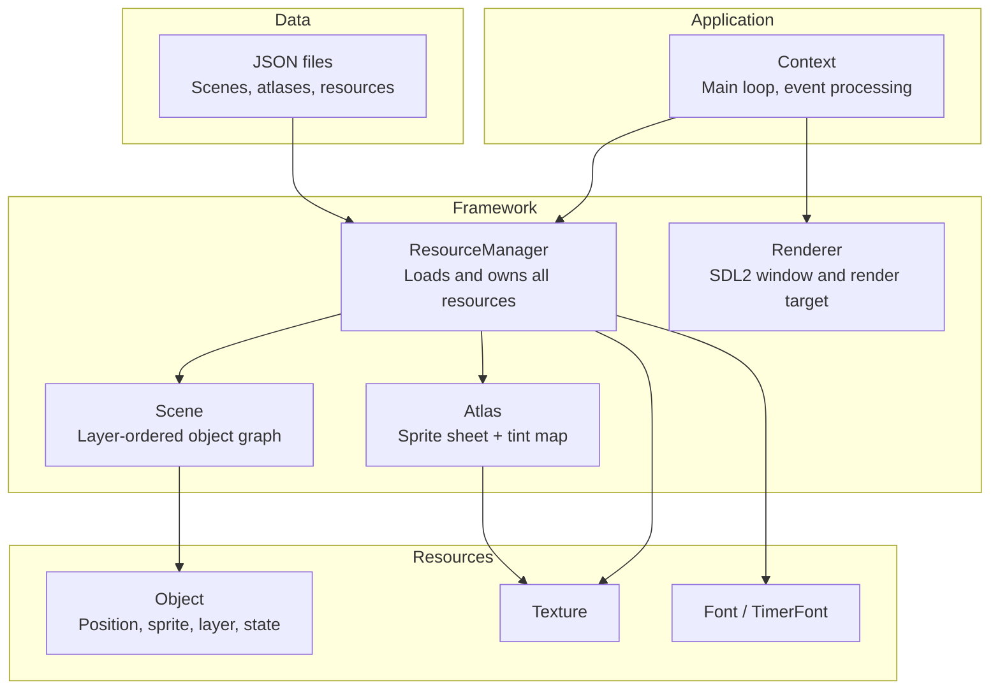
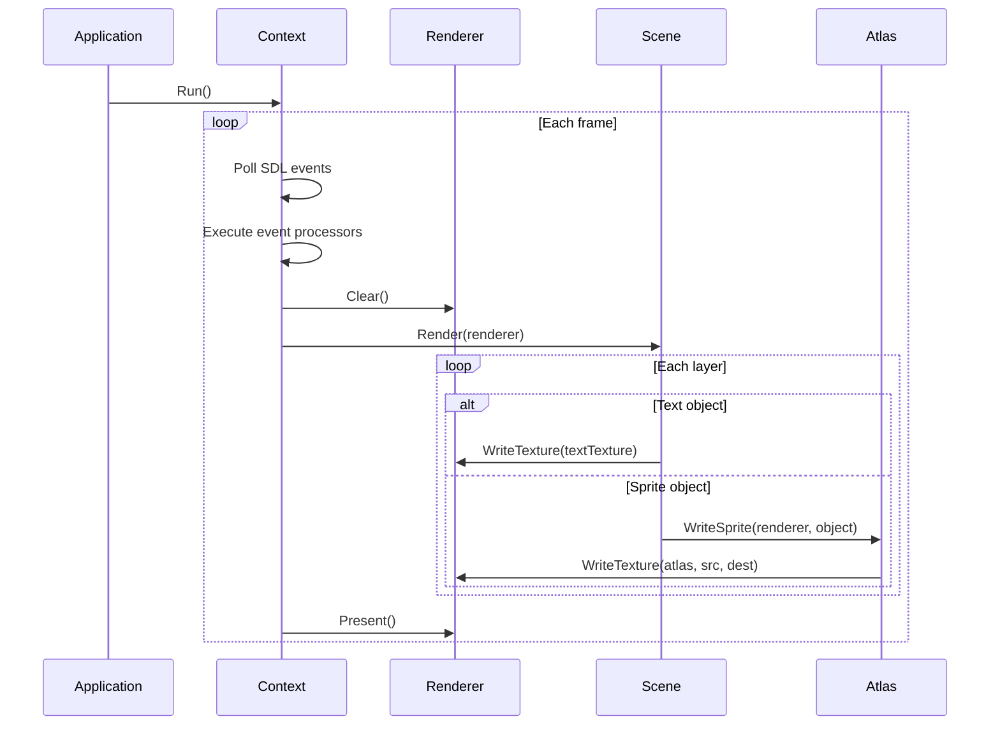

# Gambit !(Hat)[./Resources/Hat.jpg]

*Gambit* is a general-purpose interactive application framework built on SDL2, targeting Linux and Raspberry Pi. Extracted from [ChessClock](https://github.com/cschladetsch/ChessClock).

Features a sprite atlas system, JSON-driven resource loading, scene graph, font rendering via SDL_ttf, and audio support. All third-party dependencies are vendored and built statically -- no system SDL required.

## Architecture

Gambit is organised into three layers: core types, a resource system, and an application context that drives the main loop.



## Render Loop



## Requirements

- CMake 3.12+
- GCC 13+ or Clang
- C++17

## Building

```bash
./b --run-tests
```

Or manually:

```bash
cmake -S . -B build
cmake --build build -j$(nproc)
ctest --test-dir build --output-on-failure
```

## Raspberry Pi

```bash
sudo apt update
sudo apt install make cmake git git-lfs
sudo apt upgrade && sudo apt autoremove
```

No additional SDL packages needed -- everything builds from vendored source in `ThirdParty/`.

## Structure

| Directory | Purpose |
|-----------|---------|
| `Include/` | Public headers |
| `Source/` | Implementation |
| `Test/` | Catch-based unit tests |
| `ThirdParty/` | Vendored dependencies (SDL2, SDL_ttf, SDL_image, freetype, nlohmann/json, crossguid) |
| `CMake/` | CMake modules and shims |
